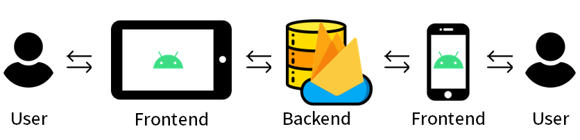
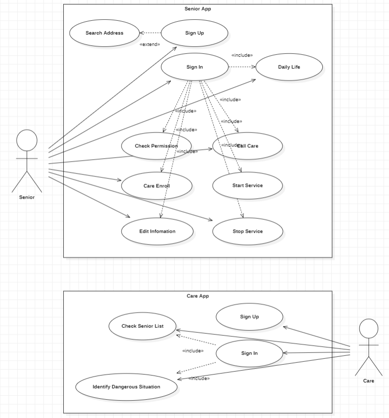
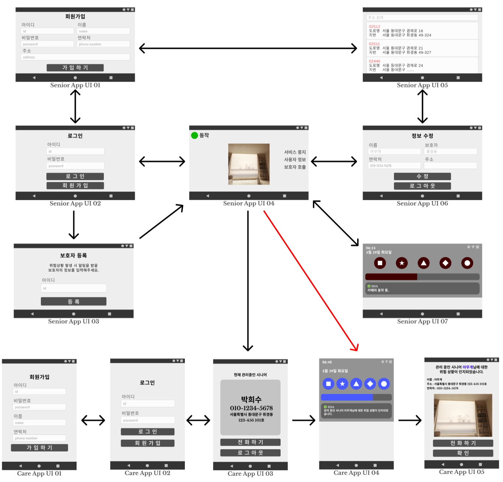
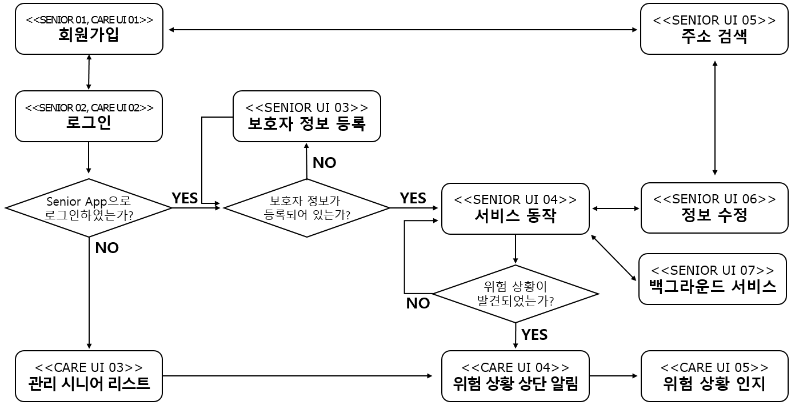
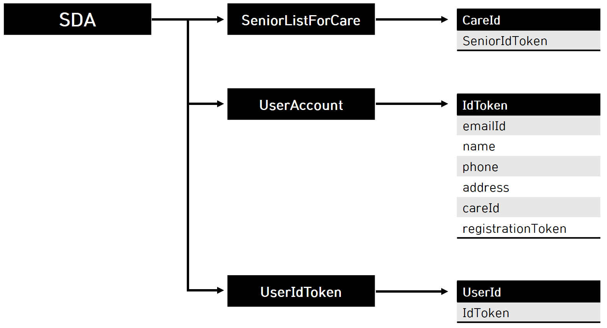
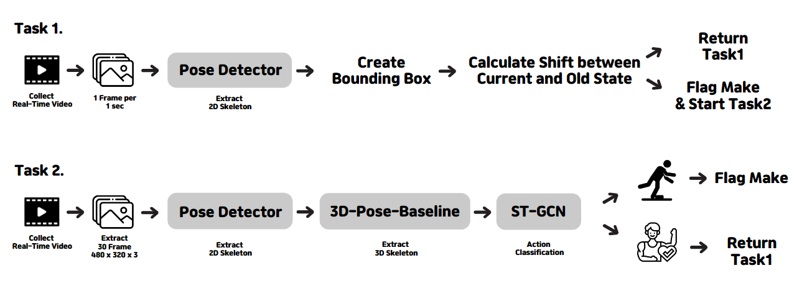

# Senior-Danger-Analysis

## 서울시립대학교, 컴퓨터과학부 - 컴퓨터과학종합설계

일상생활 데이터 분석 기반 시니어 케어 시스템 개발  
( Development of Senior Care System based on Daily Life Data )

---

## 소프트웨어 프로그램 소스

[Github] SDA 단말기앱 https://github.com/h-spear/Senior-Danger-Analysis  
[Github] SDA 보호기앱 https://github.com/h-spear/Senior-Danger-Analysis-Care-App  
[Github] SDA MODEL https://github.com/ttjh1234/CSproject_SDA

---

## 문서

|       이름       |                                           파일                                           |
| :--------------: | :--------------------------------------------------------------------------------------: |
|  프로젝트제안서  |     [PDF](docs/%ED%94%84%EB%A1%9C%EC%A0%9D%ED%8A%B8%EC%A0%9C%EC%95%88%EC%84%9C.pdf)      |
| 경쟁력분석보고서 | [PDF](docs/%EA%B2%BD%EC%9F%81%EB%A0%A5%EB%B6%84%EC%84%9D%EB%B3%B4%EA%B3%A0%EC%84%9C.pdf) |
|  개념설계보고서  |     [PDF](docs/%EA%B0%9C%EB%85%90%EC%84%A4%EA%B3%84%EB%B3%B4%EA%B3%A0%EC%84%9C.pdf)      |
|  상세설계보고서  |     [PDF](docs/%EC%83%81%EC%84%B8%EC%84%A4%EA%B3%84%EB%B3%B4%EA%B3%A0%EC%84%9C.pdf)      |
|    최종보고서    |              [PDF](docs/%EC%B5%9C%EC%A2%85%EB%B3%B4%EA%B3%A0%EC%84%9C.pdf)               |

---

## 개발 과제 요약

어르신들의 건강 및 안전 케어에 대한 관심이 높아지고 있으며, 이를 위한 다양한 서비스가 검토되고 있다. 특히 어르신들의 거주 공간에서 생활 정보를 바탕으로 어르신들의 응급 안전 대응 및 건강 관리를 할 수 있다면 이는 매우 효과적인 서비스가 될 것이다. 본 개발의 목표는 디스플레이형 AI 단말기를 활용하여 65세 이상의 시니어를 대상으로 일상 생활 데이터를 모으고, 앞에서 말한 서비스 중 실시간 행동 분석을 통한 어르신들의 안전 케어 및 위험 상황 판단에 대한 스마트 서비스를 제공하는 시스템을 개발하는 것이다.

### **기술적 기대 효과**

기존의 연구되었던 실시간 행동 분석 관련 프로젝트에서는 CCTV나 IP 카메라에 연결된 RTSP 서버는 행동인식 서버에 실시간으로 동영상을 전송하고, 촬영된 영상은 스마트폰과 같은 사용자의 애플리케이션으로 전송하여 모니터링하는 기법을 사용하고 있다. 하지만, 다수의 CCTV와 연결된 서버는 많은 영상 처리 및 저장과 관련하여 실시간 성능 및 수용력에 한계를 지니며 병목 현상이 이루어지는 문제가 있다. 해당 프로젝트에서는 AI 단말기 내에서 프레임 추출, 행동 분류, 알림 전송 기능을 실행하고 처리하는 형식으로 구현하여 병목 현상을 방지할 수 있을 것이다. 이러한 면에서 많은 사용자들을 수용할 수 있는 수용력을 가진다. 또한 일련의 진행과정에서 서버와의 통신과정이 제외되기 때문에 시간이 단축될 것이다.

### **경제적 및 사회적 파급효과**

AI 단말기가 시니어들의 주거공간에 보급되고 있는 가운데, 여러 기기들에서 처리하는 것이 아닌, 해당 단말기를 통해 서비스를 제공하므로 추가적인 단말기 구입 비용이 절약된다. 앱 내에서 진행되는 서비스 특성상 서버 구현에 드는 비용도 없다. 또한, 현재 국가 주도 및 지자체에서 어르신들의 건강 관리 및 위험 상황들을 파악 및 예방, 대처하려는 노력을 하고 있다. 이에 관련지어, 일상생활에서 어르신들의 위험상황을 탐지하고 보호자에게 알림을 주어 빠른 대처가 가능할 것이고 한계가 정해져있는 예산 안에서 많은 노인분들을 케어하는 입장인 지자체에게 좋은 선택지가 될 것이다.

---

## 구성원 및 추진체계

| 이름             | 책임                                       | 세부 내용                                                                                                                        |
| ---------------- | ------------------------------------------ | -------------------------------------------------------------------------------------------------------------------------------- |
| 박희수<br>(팀장) | 프로젝트 관리자<br>안드로이드 앱 개발 보조 | 1. 전체 프로젝트 관리 및 일정 조율<br>2. 최종 검토 및 승인<br>3. 단말기와 스마트폰 사이의 통신 구현<br>4. 파이어베이스 기능 연결 |
| 김현창           | 안드로이드 앱 개발                         | 1. Android Application 작성<br>2. 시니어앱&보호자 앱 총괄<br>3. 카메라 제어 및 딥러닝 모델 이식<br>4. UI 디자인                  |
| 정윤조           | 안드로이드 앱 개발                         | 1. Android Application 작성<br>2. 단말기와 스마트폰 앱 통신 구현<br>3. 파이어베이스 기능 연결                                    |
| 최성수           | 딥러닝 모델 개발                           | 1. 데이터 전처리<br>2. 모델 구축 및 학습<br>3. 모델 평가<br>4. Android에 이식가능한 형태로 모델 배포                             |

---

## 소프트웨어 설계

### **SYSTEM**



#### ◇ Frontend

-   Android Studio를 이용하여 구현한다.
-   회원가입, 로그인, 주요 기능을 위한 화면을 생성하고, User가 발생시키는 이벤트를 받아 Backend단으로 넘긴다.

#### ◇ Backend

-   Firebase가 제공하는 기능들을 이용하여 구현한다.
-   실시간 데이터베이스 기능을 이용하여 User들의 정보를 저장/수정한다.
-   인증 기능을 이용하여 User 인증을 진행한다.
-   스토리지 기능을 이용하여 이미지를 저장/불러오기한다.
-   호스팅 기능을 이용하여 주소API를 가져와 주소검색 액티비티를 제공한다.
-   Frontend단에서 온 이벤트를 처리하고 결과값을 형태에 맞춰 반환한다.
-   딥러닝 모델은 서버에서 처리하지 않고 앱 내부에서 처리하여 결과만 Backend로 넘긴다.

#### ◇ 장점

-   모든 데이터는 Backend에 모이기 때문에 데이터의 구성과 관리 측면에서 유용하다.
-   서버를 따로 만들어서 쓰는 것이 아니라 제공하는 서비스를 통해 쓰기 때문에 유지보수에 좋고 편리성이 뛰어나다.

### **USECASE**



### **UI FLOW**




### **DB**

Firebase Realtime Database



```json
“SeniorListForCare”:{
	“CareId”:“SeniorIdToken”,
	...
}

“UserAccount”:{
	“IdToken”:{
		“emailId”:“email Id”,
		“name”:“user name”,
		“phone”:“phone number”,
		“address”:“address info”,
		“careId”:“care id for senior account”,
		“registrationToken”:“registration token value”
	},
	...
}

“UserIdToken”:{
	“userId”:“idToken”
	...
}
```

### **MODEL**



---

## 평가

### **평가 기준**

|  평가항목   |                                평가방법                                |            적용기준             |  개발 목표치   | 비중(%) |
| :---------: | :--------------------------------------------------------------------: | :-----------------------------: | :------------: | :-----: |
| 분류 정확도 |        테스트 셋 평가와<br>팀원들이 직접 상황을 재현해보며 평가        |  Accuracy,<br>100회 이상 평가   | 평균 90% 이상  |   40    |
|  모델 속도  |        입력값을 넣었을 때,<br>최종 결과까지의 출력 시간을 계산         | System time,<br>200회 이상 측정 | 평균 10초 이하 |   40    |
|  응답 시간  | 위험 상황 데이터를 입력 후,<br>보호자 앱에 전송되는데 걸리는 시간 계산 | System time,<br>50회 이상 측정  | 평균 5분 이하  |   20    |

### **평가 결과**

#### ◇ 분류 정확도

| 방향 | 낙상 인지 | 횟수 | 정확도 |
| :--: | :-------: | :--: | :----: |
| 전방 |    61     | 100  |  61%   |
| 후방 |    63     | 100  |  63%   |
| 좌측 |    78     | 100  |  78%   |
| 우측 |    80     | 100  |  80%   |

#### ◇ 모델 속도

|        모델        | 실행 횟수 | 평균 속도(ms) |
| :----------------: | :-------: | :-----------: |
| Pose Detection API |   2,000   |    0.5105     |
|  3D Pose Baseline  |   2,000   |     4.706     |
|       ST-GCN       |    500    |    743.102    |

#### ◇ 응답 시간

|       항목       | 실행 횟수 | 평균 속도(s) |
| :--------------: | :-------: | :----------: |
| 보호자 호출 알림 |    50     |    2.068     |
|  위험 상황 알림  |    50     |    3.242     |

### **평가 결과 분석**

낙상에 대한 상황이 아닌 일상 생활에서도 1차 알고리즘을 통과하는 경우가 있었다. 1차 알고리즘이 통과하는 원인을 보니 인간이 아닌 물건을 인간 객체로 인식하는 경우, 낙상이 아닌 상황이지만 1차 조건식을 통과하는 행동(ex. 다리를 벌리고 몸을 숙이는 행동) 등이 있었다. 하지만 이런 경우에는 1차는 통과하지만 쓰러져있는 상황이 아니기 때문에 2차 판단인 딥러닝 모델을 통과하지 못하여 최종적으로는 낙상으로 판단하지 않았다.

낙상에 대한 분류 정확도를 전,후,좌,우 방향으로 나누어 테스트를 진행하였다. 좌,우에 비해서 전,후의 정확도가 더 낮은 것을 확인할 수 있었다. 이는 1차적으로 스켈레톤 구조를 추출하는 Pose Detection API의 한계였다. Pose Detection API는 얼굴로 인간 객체를 찾고, 얼굴을 기반으로 나머지 관절 정보를 추출한다. 하지만 전방, 후방으로 낙상을 하는 경우에는 카메라에 얼굴이 잘 안보이는 경우가 많았고, 이 때문에 아예 관절 정보를 추출하지를 못하였다. 이러한 경우 때문에 전,후방의 정확도가 좌,우에 비해서 낮았다. 좌,우로 넘어지는 경우에는 전,후방에 비해 얼굴이 카메라에 나와 객체를 잘 탐지할 확률이 확실히 높아 낙상을 잘 인지하였지만, 관절 정보를 추출할 수 없을 정도로 얼굴이 보이지 않는 경우가 있어 낙상으로 인지되지 않을 때가 있었다.

딥러닝 모형 기반인 2차 판단의 성능은 train_set과 test_set에서 정확도는 0.9971, 0.9961로 높은 성능을 보였다. 하지만, 이는 잘 구성된 학습 데이터 상에서의 성능이였고, 실제 AI 단말기에서 촬영된 영상을 가지고 여러가지 행동을 취해보며 성능을 측정했다. 기존의 학습 데이터에서 존재했던 47개의 행동 종류 외의 다른 행동을 취했을 경우 모델이 해당 행동을 잘 처리하지 못하는 문제가 존재했다. 학습 데이터가 수집될 때 사용되었던 카메라의 성능, 각도가 현재 AI 단말기에서 사용되는 카메라와 다르다는 점도 성능 하락의 문제로 생각되었다. 실생활에서 예측할 수없는 수많은 행동들을 잘 분류할 수 있도록, 여러가지 행동들이 있는 대규모 영상 데이터셋을 통해 추가적인 학습이 진행되어야할 것이라고 판단되고, 모델의 최적화를 더 진행하여 강건한 시스템을 만들어야된다고 판단된다.
<br><br>

#### **학습 데이터 환경에서의 모델 평가 결과**

|          | Predict 0 | Predict 1 |
| :------: | :-------: | :-------: |
| Target 0 |   18804   |    26     |
| Target 1 |    35     |   2507    |

Train 예측 정확도 : 0.9971
<br>

|          | Predict 0 | Predict 1 |
| :------: | :-------: | :-------: |
| Target 0 |   4699    |    11     |
| Target 1 |    10     |    623    |

Test 예측 정확도 : 0.9961

\* Target : 실제 영상에 라벨링된 값으로, 0은 쓰러지기아닌 행동, 1은 쓰러지신 행동을 의미  
\* Predict : 입력에 대한 모델의 추론 값으로, 0은 쓰러지기아닌 행동, 1은 쓰러지신 행동을 의미

---

## 참고문헌 및 참고사이트

● [1] 김성현, 김용욱, 권대규, 김남균(2006), “낙상 방향에 따른 신체 관절의 동적 특성 분석”, p447-p448  
● [2] 김선기, 안종수, 김원호(2016), “영상처리 기반 낙상 감지 알고리즘의 구현”, p56-p59  
● [3] 김지민, 윤기범, 심정용, 박소영, 신연순(2020), “YOLOv3 알고리즘을 이용한 실시간 낙상 검출”  
● [4] 강윤규, 강희용, 원달수(2021), “PoseNet과 GRU를 이용한 Skeleton Keypoints 기반 낙상 감지”, p127-p132  
● [5] 임태규, 『텐서플로 라이트를 활용한 안드로이드 딥러닝』, 한빛미디어(2021)  
● [6] 장재영 외 4인, 지능형 행동인식 기술을 이용한 실시간 동영상 감시 시스템 개발 (The Journal of The Institute of Internet, Broadcasting and Communication (IIBC) Vol. 19, No. 2, pp.161-168, Apr. 30, 2019. pISSN 2289-0238, eISSN 2289-0246)  
● [7] Sijie Yan, Yuanjun Xiong, Dahua Lin. “Spatial Temporal Graph Convolutional Networks for Skeleton-Based Action Recognition”  
● [8] Valentin Bazarevsky, Ivan Grishchenko, Karthik Raveendran, Tyler Zhu, Fan Zhang, Matthias Grundmann, Google Research. “BlazePose: On-device Real-time Body Pose tracking”  
● [9] Daniele Grattarola, Cesare Alippi. “Graph Neural Networks in TensorFlow and Keras with Spektral”  
● [10] Julieta Martinez, Rayat Hossain, Javier Romero, and James J. Little. “A simple yet effective baseline for 3d human pose estimation”

◇ Foreground Service

-   https://developer.android.com/guide/components/foreground-services

◇ Pose Detection API

-   https://developers.google.com/ml-kit/vision/pose-detection

◇ Firebase

-   https://firebase.google.com/docs/auth
-   https://firebase.google.com/docs/storage
-   https://firebase.google.com/docs/database
-   https://firebase.google.com/docs/hosting
-   https://firebase.google.com/docs/cloud-messaging

◇ Tensorflow Lite

-   https://www.tensorflow.org/lite

◇ Article

-   노년층 증가로 ‘시니어 맞춤형 서비스’ 출시하는 기업들
    http://it.chosun.com/site/data/html_dir/2020/11/07/2020110701161.html
-   '초고령사회' 진입 초읽기…이통3사, '시니어 케어' 사업 확대에 적극 나서
    https://www.greened.kr/news/articleView.html?idxno=289627
-   홀로 죽음 맞는 '고독사' 3배 늘었다…43%는 '65세 이상’
    https://www.nocutnews.co.kr/news/5698160
-   통화중 ATM 인출 등 이상행동...신한은행, AI로 보이스피싱 예방
    https://news.mt.co.kr/mtview.php?no=2022030710540742302
-   SKT, AI 기반 지능형 영상분석 솔루션 내년 상반기 출시...자체 AI칩으로 기술 격차 자신
    http://www.aitimes.com/news/articleView.html?idxno=141159

◇ Data Resource

-   한국전자통신연구원(ETRI) : https://ai4robot.github.io/etri-activity3d-livinglab/
-   Jinhyeok Jang, Dohyung Kim, Cheonshu Park, Minsu Jang, Jaeyeon Lee, Jaehong Kim, “ETRI-Activity3D: A Large-Scale RGB-D Dataset for Robots to Recognize Daily Activities of the Elderly”, International Conference on Intelligent Robots and Systems (IROS) 2020, pp.10990-10997

---

## 관련특허

● 엘에스산전 주식회사, 독거노인 케어 시스템, 10-2013-0053844, 2013  
● 한남대학교 산학협력단, 리모콘을 이용한 위험 관리 시스템, 10-2016-0018784, 2016
